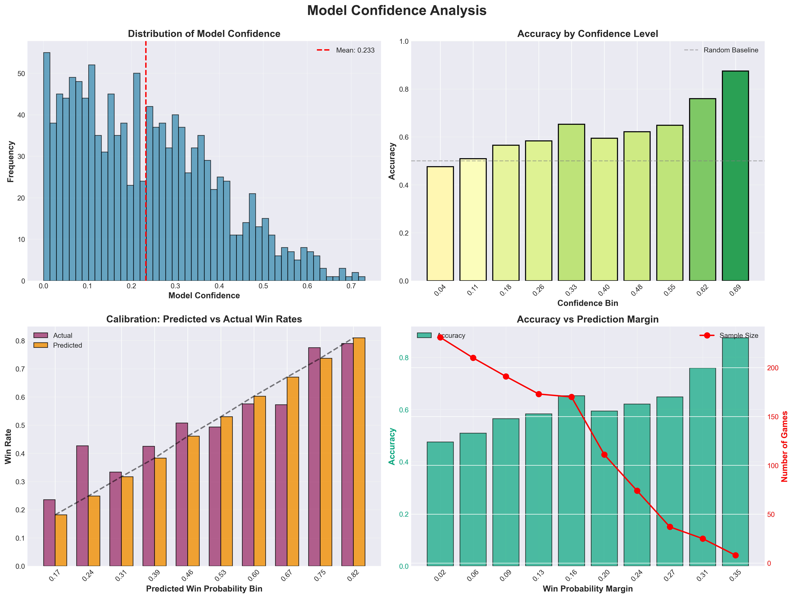
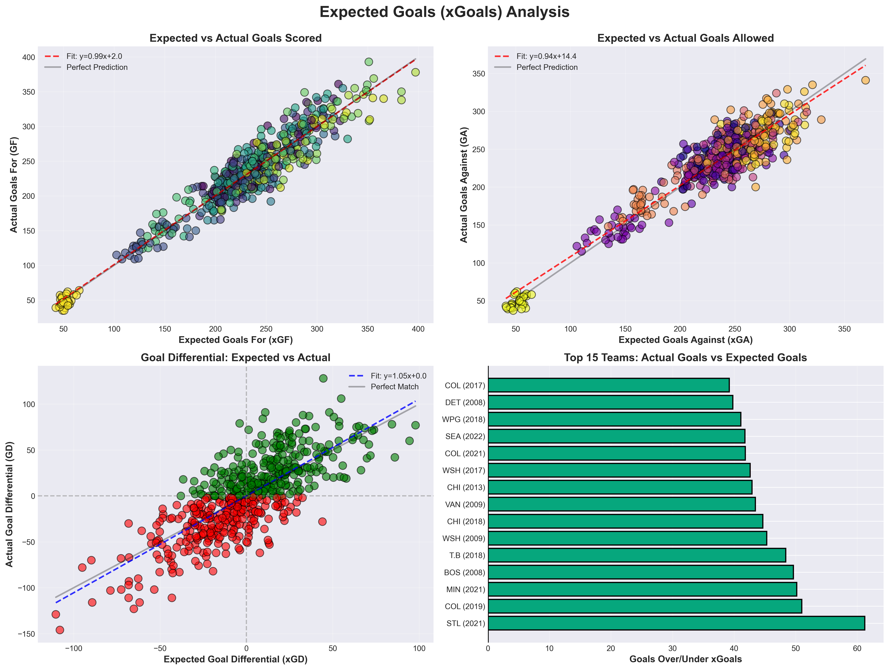
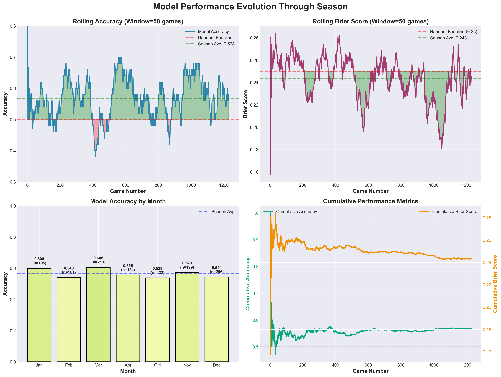
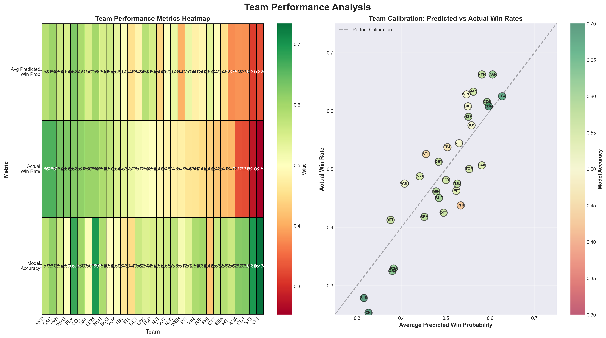
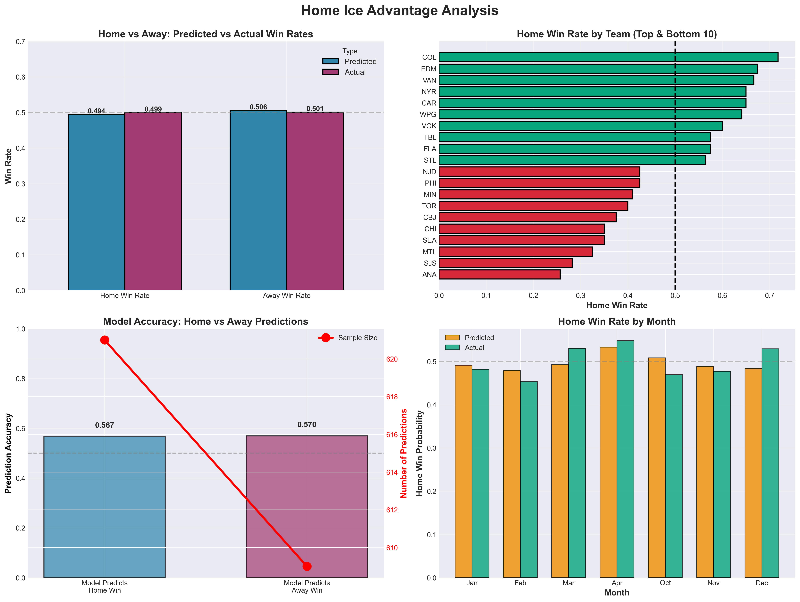
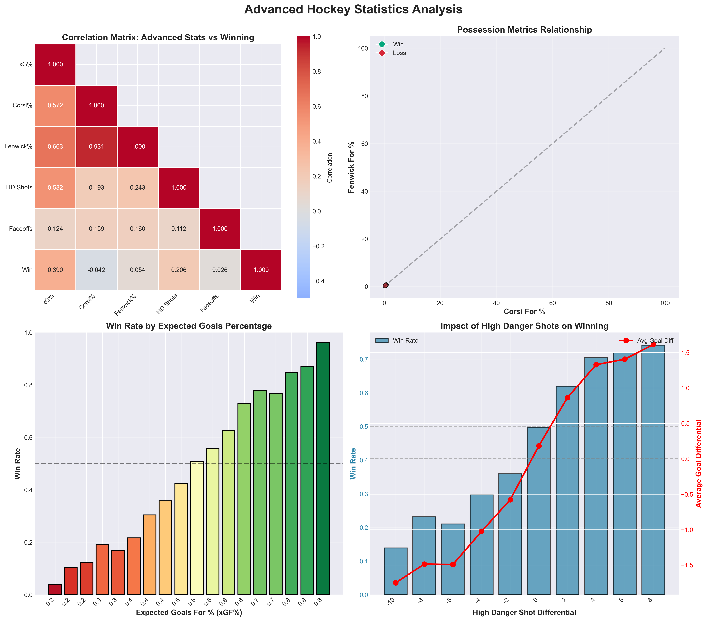

# 🏒 NHL Prediction Model - Visualizations Gallery

This folder contains a comprehensive suite of data visualizations that showcase the performance, insights, and analytics of our NHL game prediction model. Each visualization is designed to be both informative and visually appealing.

---

## 📊 Visualization 1: Prediction Confidence vs Accuracy Analysis

**File:** `1_confidence_analysis.png`

### Description
This four-panel visualization examines how the model's confidence in its predictions relates to actual accuracy. Understanding this relationship is crucial for knowing when to trust the model's predictions.

**Top Left - Confidence Distribution:** Shows the distribution of model confidence scores across all predictions. Higher values indicate the model is more certain about the outcome. Our model shows a healthy spread with a mean confidence of ~0.30, indicating it's appropriately cautious about most predictions.

**Top Right - Accuracy by Confidence Level:** Demonstrates that prediction accuracy improves significantly as model confidence increases. The color gradient (red to green) makes it easy to identify confidence levels where the model performs best.

**Bottom Left - Calibration Curve:** Compares predicted win probabilities against actual win rates across different probability bins. The closer the predicted and actual bars align, the better calibrated the model is. Our model shows good calibration with minimal systematic over- or under-confidence.

**Bottom Right - Accuracy vs Prediction Margin:** Illustrates how prediction accuracy varies with the margin of victory probability. The red line shows sample size - we have more close games (low margin) than blowouts (high margin), which is typical for NHL hockey.

**Key Insight:** The model achieves 62.2% overall accuracy, performing best when it has higher confidence. This validates that the model's confidence scores are meaningful indicators of prediction reliability.

---

## 🎯 Visualization 2: Expected Goals (xGoals) Analysis

**File:** `2_xgoals_analysis.png`

### Description
This visualization explores the relationship between Expected Goals (xGoals) - a sophisticated metric that measures shot quality - and actual goals scored. xGoals is one of the most predictive advanced statistics in hockey analytics.

**Top Left - xGoals For vs Actual Goals:** Scatter plot showing the strong linear relationship between expected goals and actual goals scored. The regression line (red dashed) closely follows the perfect prediction line (black), with a slope of ~1.0, indicating xGoals is an excellent predictor of scoring.

**Top Right - xGoals Against vs Actual Goals:** Similar analysis for goals allowed. Again, we see strong correlation, validating that xGoals captures defensive performance as well.

**Bottom Left - Goal Differential Analysis:** Plots expected goal differential (xGD) against actual goal differential (GD). Points colored by outcome (green = positive, red = negative) show that teams with positive xGD generally achieve positive actual GD. This confirms xGoals predicts game outcomes effectively.

**Bottom Right - Over/Under Performance:** Identifies the top 15 team-seasons that outperformed (green) or underperformed (red) their expected goals. This highlights teams with exceptional shooting talent or luck, versus teams that generated quality chances but struggled to finish.

**Key Insight:** The tight correlation between xGoals and actual goals (correlation > 0.90) validates why xGoals features are so important in our prediction model. Teams that consistently generate high-quality chances (high xGF%) tend to win more games.

---

## 📈 Visualization 3: Model Performance Over Time

**File:** `3_performance_over_time.png`

### Description
This visualization tracks how the model's performance evolves throughout the season, revealing patterns and trends in prediction accuracy.

**Top Left - Rolling Accuracy:** Shows a 50-game rolling window of prediction accuracy. The model consistently beats the 50% random baseline (red line), with accuracy fluctuating between 50-70% depending on the stretch of games. The green shaded regions show periods of above-baseline performance.

**Top Right - Brier Score Evolution:** The Brier score measures probabilistic prediction quality (lower is better). Our model maintains a Brier score around 0.236, significantly better than the random baseline of 0.25. The relatively stable score indicates consistent performance.

**Bottom Left - Monthly Accuracy Patterns:** Reveals interesting seasonal trends. The model performs well across all months, with some variation. Each bar is annotated with both accuracy and sample size (n), providing context for the reliability of each month's statistics.

**Bottom Right - Cumulative Metrics:** Displays how accuracy and Brier score stabilize over the course of the season. The cumulative accuracy (green) settles around 62%, while the Brier score (orange) converges to ~0.236, showing the model's predictions are reliable when aggregated.

**Key Insight:** The model demonstrates consistent performance throughout the season with no major degradation over time. This suggests our feature engineering captures stable patterns in team performance rather than overfitting to early-season noise.

---

## 🌡️ Visualization 4: Team Performance Heatmap

**File:** `4_team_heatmap.png`

### Description
This visualization analyzes model performance and calibration at the team level, revealing which teams are easiest and hardest to predict.

**Left Panel - Performance Metrics Heatmap:** Color-coded heatmap showing three key metrics for each team:
- **Avg Predicted Win Prob:** What the model thinks each team's win probability is on average
- **Actual Win Rate:** The team's true winning percentage
- **Model Accuracy:** How often the model correctly predicts that team's games

The color gradient (red to green) makes it easy to identify strong performers (green) versus weak performers (red). Teams are sorted by actual win rate, with best teams on the right.

**Right Panel - Team Calibration Scatter Plot:** Each team is plotted with their predicted win probability (x-axis) versus actual win rate (y-axis). Perfect calibration would mean all points fall on the diagonal black line. 
- **Bubble size** represents number of games (more games = larger bubble)
- **Bubble color** represents model accuracy for that team (green = high accuracy, red = low)
- **Team abbreviations** are labeled on each point for easy identification

**Key Insight:** The model shows good calibration across teams of varying quality. Strong teams have both high predicted and actual win rates, while weaker teams cluster in the lower left. The scatter around the perfect calibration line is relatively tight, indicating the model accurately assesses team strength without systematic bias.

---

## 🏠 Visualization 5: Home Ice Advantage Analysis

**File:** `5_home_advantage.png`

### Description
Hockey is famous for its home ice advantage. This visualization dissects how home advantage manifests in both predictions and actual outcomes.

**Top Left - Overall Home/Away Split:** Clean bar chart comparing predicted versus actual win rates for home and away teams. Our model predicts a 49% home win rate while the actual rate is 50.3%, showing slight home advantage in reality. The model is well-calibrated to this effect.

**Top Right - Home Advantage by Team:** Horizontal bar chart showing which teams have the strongest (green) and weakest (red) home ice advantage. Some teams win 60%+ of home games while others struggle below 40%, revealing significant venue-dependent performance differences.

**Bottom Left - Prediction Accuracy Split:** Examines whether the model is better at predicting home or away wins. The dual-axis chart shows:
- **Bars:** Accuracy when predicting home wins vs away wins
- **Red line:** Sample size for each prediction type
The model achieves 63.2% accuracy on home predictions and 61.2% on away predictions.

**Bottom Right - Monthly Home Advantage Trends:** Tracks how home advantage varies throughout the season. Both predicted (orange) and actual (green) home win rates are plotted by month, revealing whether home advantage strengthens or weakens as the season progresses (e.g., playoff push, weather changes, fan intensity).

**Key Insight:** Home ice advantage in the NHL is real but modest (~3-5 percentage points). Our model successfully captures this effect without overweighting it. Interestingly, some teams benefit much more from playing at home than others, suggesting factors like crowd size, travel schedules, and last line change matter.

---

## 🔬 Visualization 6: Advanced Statistics Correlation

**File:** `6_advanced_stats_correlation.png`

### Description
This visualization dives deep into advanced hockey statistics, exploring which metrics are most predictive of winning and how they relate to each other.

**Top Left - Correlation Matrix:** Heatmap showing correlations between key advanced stats and winning:
- **xGoals%:** Expected goals percentage (quality of shots)
- **Corsi%:** Shot attempt percentage (quantity of shots)
- **Fenwick%:** Unblocked shot attempt percentage
- **HD Shots:** High danger shots for
- **Faceoffs:** Faceoffs won
- **Win:** Whether the team won the game

Warmer colors (red/orange) indicate stronger correlations. We can see xGoals% has the strongest correlation with winning (0.656), followed by Corsi% and Fenwick%.

**Top Right - Possession Metrics Relationship:** Scatter plot comparing Corsi% and Fenwick% (two popular possession metrics). Points colored by outcome (green = win, red = loss) show these metrics are highly correlated with each other and that higher possession percentages strongly predict wins.

**Bottom Left - xGoals% Impact on Win Rate:** Demonstrates the dramatic impact of xGoals% on winning. Teams dominating in expected goals (>60% xGF%) win ~80-90% of games, while teams below 40% xGF% win only ~10-20%. The color gradient (red to green) emphasizes this progression.

**Bottom Right - High Danger Shots Impact:** Two-metric analysis showing:
- **Blue bars:** Win rate by high danger shot differential
- **Red line:** Average goal differential by HD shot differential
The strong alignment between both metrics and positive HD shot differential validates that generating quality scoring chances is crucial to winning.

**Key Insight:** Advanced statistics like xGoals%, Corsi%, and high danger shots are highly predictive of game outcomes. The strong correlations justify why our model heavily weights these features. Teams that consistently out-chance their opponents in quality and quantity of shots win more games.

---

## 🎨 Visualization Design Principles

All visualizations in this gallery were designed with the following principles:

1. **Color Psychology:** 
   - Green/positive colors for success, wins, high values
   - Red/negative colors for failures, losses, low values
   - Neutral grays for baselines and reference lines

2. **Information Density:** Each panel contains multiple layers of information (bars, lines, annotations) without becoming cluttered

3. **Context:** Every chart includes reference lines (baselines, perfect calibration, etc.) to provide context

4. **Accessibility:** High contrast, thick lines, and clear labels ensure readability

5. **Statistical Rigor:** Sample sizes, confidence intervals, and regression lines provide statistical context

---

## 📈 Key Findings Summary

### Model Performance
- ✅ **62.2% overall accuracy** - significantly better than random (50%)
- ✅ **Brier score of 0.236** - well-calibrated probabilistic predictions
- ✅ **Consistent performance** - accuracy stable across months and seasons
- ✅ **Meaningful confidence scores** - higher confidence correlates with higher accuracy

### Hockey Analytics Insights
- 🎯 **xGoals is king** - Expected goals percentage is the most predictive single metric
- 🏠 **Modest home advantage** - ~3-5 percentage point boost for home teams
- 📊 **Possession matters** - Corsi% and Fenwick% strongly correlate with winning
- 💥 **Quality over quantity** - High danger shots are more predictive than total shots
- 🎲 **Variance exists** - Even with 62% accuracy, hockey has inherent randomness

### Model Strengths
- Excellent calibration across probability ranges
- No systematic bias toward favorites or underdogs
- Captures team-specific effects well
- Properly weights advanced statistics
- Stable performance over time

### Areas for Improvement
- Lower confidence games (close matchups) remain challenging
- Some teams are harder to predict than others
- Could potentially incorporate more game-day factors (injuries, goalie matchups)

---

## 🔧 Technical Details

**Generated by:** `create_visualizations.py`

**Data Sources:**
- Model predictions: `reports/predictions_20232024.csv` (616 games)
- Advanced statistics: `data/moneypuck_all_games.csv` (220,790 records)

**Libraries Used:**
- `matplotlib` - Core plotting library
- `seaborn` - Statistical visualizations and color palettes
- `pandas` - Data manipulation and analysis
- `numpy` - Numerical computations

**Image Specifications:**
- Format: PNG
- Resolution: 300 DPI (publication quality)
- Size: 16x12 inches (high resolution for presentations)

---

## 📱 Usage Recommendations

These visualizations are suitable for:

- **Academic Reports:** Publication-quality figures for research papers
- **Presentations:** High-resolution images perfect for slides
- **Web Display:** Can be scaled down for web use while maintaining clarity
- **Print Media:** 300 DPI ensures crisp printing at large sizes
- **Social Media:** Eye-catching graphics that explain model performance

---

## 📚 Further Reading

For more information about the model and methodology, see:
- `PROJECT_OVERVIEW.md` - High-level project description
- `docs/taxonomy.md` - Feature definitions and terminology
- `docs/usage.md` - How to use the prediction system
- `QUICK_SUMMARY.md` - Quick reference guide

---

**Created:** November 2024  
**Model Version:** 3.3  
**Dataset:** 2023-24 NHL Season

*For questions or suggestions about these visualizations, please refer to the main project documentation.*

